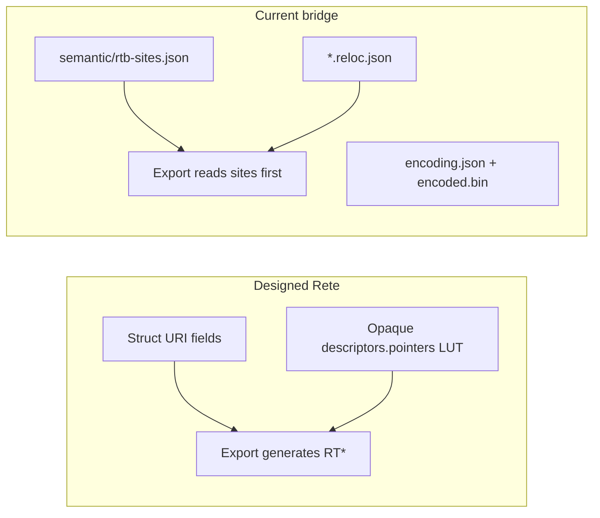
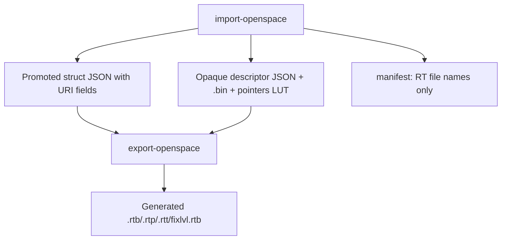

# Remove relocation storage from Rete

Strip all relocation inventory from Rete packages (`.reloc.json`, `*-sites.json`, `relocations/*`, encoding cache) and make OpenSpace export derive every RT* file purely from URI pointers (struct fields + opaque `pointers` LUT). Byte-identical `cmp` remains the gate.

## Problem

Step 5 achieved parity by **moving** RTB data into Rete, not replacing it:



On `output/test-rete/astrolabe`: **69,922** `rtb-sites` rows (~17 MB), **14,983** `.reloc.json` files, and **1,180** opaque descriptors with **duplicate** inline `pointers` + `.reloc.json`. The designed model is already specified in [`docs/rete-format.md`](../docs/rete-format.md) lines 226–227: opaque JSON carries the `pointers` LUT; RT* are **generated at export**.

**Remove all RT*-related package storage** (including encoding cache) while **keeping byte-identical `cmp`**.

---

## Target architecture



**Rete stores:** canonical content + URI links only.  
**Rete does not store:** pointer inventories, RTB rows, module/id targets, `.reloc.json`, `*-sites.json`, `relocations/`, encoding blobs.

**Export derives RT* by:**
1. Laying out SNA from `content.json` elements with URI-resolved bytes
2. Walking each element's codec `PointerFields` / `IPointerArrayCodec` / opaque `pointers` LUT
3. Emitting relocation rows (source VM offset → target block) from resolved URIs
4. LZO-compressing pointer blocks on write (no stored `.encoded.bin`)

---

## Phase 1 — Delete relocation artifacts and code paths

### Remove from packages (import + existing trees)

| Artifact | Action |
|----------|--------|
| `semantic/rtb-sites.json` | Stop writing; delete on re-import |
| `semantic/*-sites.json` (rtp/rtt) | Stop writing; delete |
| `semantic/fix-level-sites.json` | Stop writing; delete |
| `**/*.reloc.json` | Stop writing; delete |
| `relocations/**` (json + encoded.bin) | Stop writing; delete |
| `semantic/*-encoding.json` | Stop writing; delete |

### Delete / gut code

| File / area | What to remove |
|-------------|----------------|
| `RelocationPointerOverlay.cs` | Entire file |
| `OpenSpacePackageCodec.cs` | `AnnotateOpaquePointersFromRelocations`, `WriteRtbSiteMetadata`, `WritePointerFileSiteMetadata`, `WriteFixLevelSiteMetadata`, `PruneRelocationPointerStorage`, `ExtractRelocationTable` pointer-json write, `Build*ReferenceTableFromSites`, `ApplyRelocationEncoding`, `CanReuseRelocationStorage` |
| `RelocationGenerator.cs` | `LoadImportedRtbSites`, `GenerateImportedRtb`, `CompleteImportedRtbDocument`, `LoadImportedPointerFileSites`, `BuildImportedPointerFileDocument`, `LoadImportedFixLevelSites`, `GenerateImportedFixLevelPointers`, `EmitJsonRelocationOverlay` |
| `RetePackageModels.cs` | `RtbSitesDocument`, `PointerFileSitesDocument`, `FixLevelSitesDocument`, `RelocationEncodingDocument`, `SemanticManifest` site/encoding paths |
| `ReferenceJson.cs` | `.reloc.json` merge in `ApplyRelocationPointerOverlay`; export uses **inline `OpaqueBinaryRecord.Pointers` only** |

### Simplify import pipeline

In `OpenSpacePackageCodec.ExtractLevel` replace post-import chain:

```
RewritePointerReferences
AnnotateOpaquePointersFromFixLevelRelocations  (keep, Fix→level URIs only)
// REMOVE: AnnotateOpaquePointersFromRelocations, WriteRtbSiteMetadata, WriteFixLevelSiteMetadata, PruneRelocationPointerStorage
```

`RelocationTables` in manifest becomes **export target list only** (`fileName`, no `jsonPath` / `encodingPath`).

---

## Phase 2 — Strengthen URI-only pointer capture on import

The designed opaque LUT must be **complete** without RTB annotation.

### Consolidate opaque pointer writing

Merge the RTB-annotation logic (currently writing `.reloc.json`) into **inline `record.Pointers`** only:

- During import, optionally walk source RTB **transiently** (read from disc, never persist) to discover pointer offsets in opaque/scene elements missing from codec scan
- Write discovered URIs into `OpaqueBinaryRecord.Pointers` via `RewriteOpaquePointersToUris` / a shared `MergePointerLut` helper
- **Never** write `targets` {module,id} — those are export-derived from URI resolution

### Scene superObjects

`SuperObjectCodec` already declares `PointerFields` at 0x04, 0x14, etc. Scene `node.json` has URI fields — **no sidecar needed**. Remove `.reloc.json` generation for scene paths entirely.

### fixlvl / Fix→level

Replace `fix-level-sites.json` with URI-driven generation per [`docs/cross-package-uris.md`](../docs/cross-package-uris.md):

- Import: `AnnotateOpaquePointersFromFixLevelRelocations` continues writing `level:/…` URIs into Fix opaque `pointers` LUT (extend to emit `level:/slots/{fixSite}.json` convention)
- Export: rewrite `GenerateFixLevelRtb` to scan Fix package elements:
  - Mapped row: Fix element offset + LUT key with `level:/` URI → resolve to level block
  - Sentinel `FF:FF`: Fix pointer slot where value escapes Fix VM range but has no `level:/` URI (algorithmic; matches [`docs/fixlvl-rtb.md`](../docs/fixlvl-rtb.md) export description)

---

## Phase 3 — Single-path RT* generation at export

### RTB (`GenerateBlockPointers`)

Make this the **only** RTB path. Per element, in order:

1. **Opaque JSON**: emit rows for every key in `record.Pointers` (offset → URI → target block via `TargetBlockResolver`)
2. **Struct codec**: `PointerFields` + resolved export bytes via `EmitPointerFields`
3. **Pointer arrays**: `IPointerArrayCodec.EnumeratePointerFields`
4. **Raw VM scan** (`RawBlobCodec`): fallback only for keys not already in LUT

Remove the overlay-first branch.

### RTP / RTT

Delete sites-first branch; always use `GeneratePointerFileEntries` (scans `files/*.gpt` / `files/*.ptx`).

### RTB binary write without encoding cache

In `WriteRelocationTable`:

- Remove `CanReuseRelocationStorage` / `ApplyRelocationEncoding`
- When generated `pointerData` matches OpenSpace compression rules, **LZO-compress** via `lzo.net` `LzoStream` (compress mode)
- Write compressed header + payload; validate checksums via `OpenSpaceChecksum`
- If LZO output is not byte-identical to original, treat as generator bug (fix ordering, `byte6`/`byte7`, trailing block data)

SNA blocks may keep **existing** `originalStorage` on `sna/` blocks (LZO cache for level payload) — that is SNA encoding, not RT inventory. Only remove RT-side `relocations/` storage.

---

## Phase 4 — Verification and gap closure

Gate:

```bash
dotnet build
dotnet run --project src/Astrolabe.Cli -- extract-intermediate \
  disc/Gamedata/World/Levels/astrolabe output/test-rete/astrolabe
dotnet run --project src/Astrolabe.Cli -- compile-intermediate \
  output/test-rete/astrolabe output/test-rete/rebuilt-astrolabe
for f in disc/Gamedata/World/Levels/astrolabe/*; do
  cmp -s "$f" "output/test-rete/rebuilt-astrolabe/${f##*/}" || echo "DIFF ${f##*/}"
done
```

**`debug-relocations`**: compare generated RT* against **source disc files** (read at compare time), not rebuilt from package storage.

Iterative gap closure (expect initial regression after bridge removal):

| Symptom | Likely fix |
|---------|------------|
| Missing RTB rows in opaque blobs | Expand import LUT (transient RTB walk) or promote codec / `IPointerArrayCodec` |
| Extra rows from VM scan | Scope scan with LUT keys; tighten `ShouldEmitRelocation` |
| `byte6`/`byte7` drift | Derive from target resolution rules; avoid zeroing non-zero trailing bytes |
| fixlvl sentinel mismatch | Refine escape-VM detection + `level:/` coverage on Fix import |
| LZO byte diff with correct pointer data | Fix compress path or pointer entry ordering |

Update `RelocationGeneratorTests.cs`: remove sites/overlay fixtures; add URI-LUT + export `cmp` integration test.

---

## Phase 5 — Documentation

Update to match implementation:

- `docs/rete-format.md` — explicit "no relocation inventory in packages"
- `notes/rete-implementation.md` — remove bridge/sidecar guidance
- `plan.md` — Step 5 completion criteria = URI-only Rete + generated RT*
- `docs/cross-package-uris.md` — mark `level:/slots/` emission as implemented (not "planned")

---

## Risk summary

| Risk | Mitigation |
|------|------------|
| Parity regression after removing 17 MB `rtb-sites` | Iterative `debug-relocations` + codec promotion |
| fixlvl sentinels without site inventory | Algorithmic FF:FF from Fix VM escape detection |
| LZO byte-identical without cache | Compress on export; fix generator ordering before blaming LZO |
| Duplicate opaque LUT sources | Single write path; delete `.reloc.json` entirely |

**Out of scope:** promoting remaining opaque kinds per [`intermediate-type-checklist.md`](intermediate-type-checklist.md) — continue incrementally as RTB gaps dictate.

## Todos

- [ ] **delete-bridge-code** — Remove RelocationPointerOverlay, *-sites models/writers, sites-first RelocationGenerator paths, and relocations/ import storage
- [ ] **uri-lut-import** — Consolidate opaque pointer capture into inline OpaqueBinaryRecord.Pointers (transient RTB walk on import, no persistence); keep Fix→level level:/ annotation
- [ ] **export-generate-only** — Make GenerateBlockPointers + GeneratePointerFileEntries + rewritten GenerateFixLevelRtb the sole RT* paths; simplify ReferenceJson export to inline LUT only
- [ ] **lzo-export** — Remove encoding cache reuse; implement LZO compression on RT* write and validate byte-identical cmp
- [ ] **verify-parity** — Re-import astrolabe, run cmp + debug-relocations vs disc; close gaps via codec/LUT promotion until 100%
- [ ] **update-docs-tests** — Update rete-format/plan/implementation docs; rewrite RelocationGeneratorTests for URI-only model